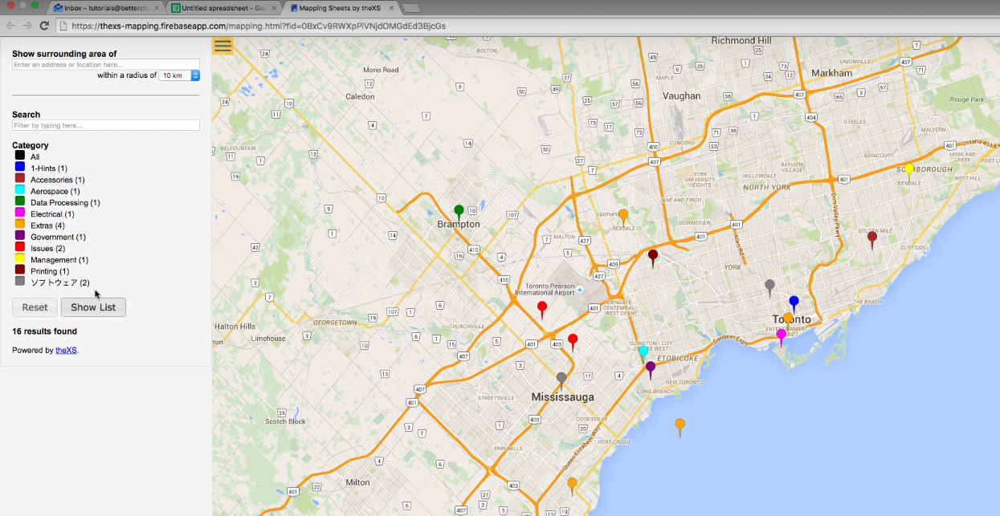

# Filometro em mapa

Algumas cidades como São Paulo, Salvador e São Luís criaram um "filometro" para mostrar como andam as filas nos diversos postos de vacinação para covid.

https://deolhonafila.prefeitura.sp.gov.br/ 
https://filometro.saude.salvador.ba.gov.br/ 
http://semit.saoluis.ma.gov.br/filometro/  

Seria interessante colocar estas informações num mapa, para cada pessoa verificar quais são as opções mais perto dela para se vacinar evitando aglomerações.

A proposta é fazer algo como é mostrado [neste vídeo](https://youtu.be/W0L2DW-6HXs?t=105) (printscreen abaixo)

# A fazer

A raspagem de dados já está feita. O próximo passo é colocar estes dados num mapa acessível pela população em geral, sem fluência em tecnologia. 

Por isso pensei em usar a api do google maps e sobrepor os marcadores no próprio google maps, onde as pessoas já tem alguma familiaridade e conseguem traçar rotas da sua posição no momento para verificar quais os postos de vacinação mais próximos.

No entanto, qualquer outra implementação que atinja o objetivo é bem vinda. 

*Lembrando: o objetivo é projetar num mapa as informações do site https://deolhonafila.prefeitura.sp.gov.br/ para a população leiga em tecnologia. Inicialmente em São Paulo. Posteriormente, gostaria de repetir o processo para outras cidades do Brasil.*

# Proposta de versões

- Versão 1.0: Postos de vacinação no mapa, disponível numa página web (talvez github pages?) ou algo do tipo pra ser acessível à população leiga em tecnologia.

- Versão 2.0: Incluir filtros de tipo de posto
  - Valores: `'POSTO VOLANTE', 'DRIVE-THRU', 'MEGAPOSTO', 'POSTO FIXO'`
- Versão 3.0: Incluir também filtros de situação (atualizado de hora em hora)
  - Valores: `'SEM FILA', 'NÃO FUNCIONANDO', 'FILA GRANDE',
           'AGUARDANDO ABASTECIMENTO', 'FILA PEQUENA', 'FILA MÉDIA'`